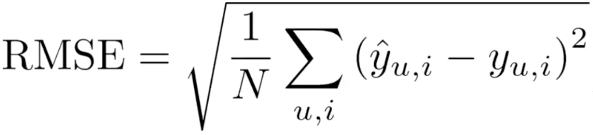
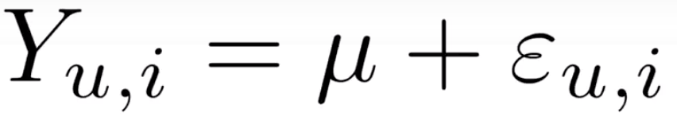
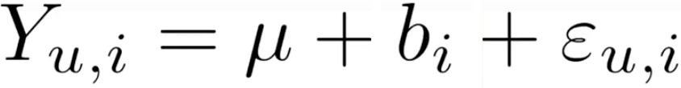
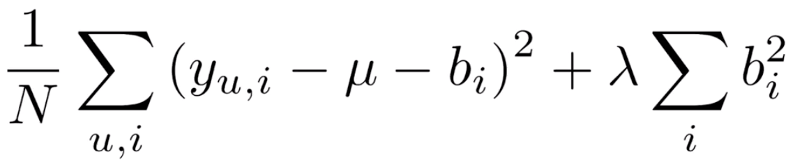
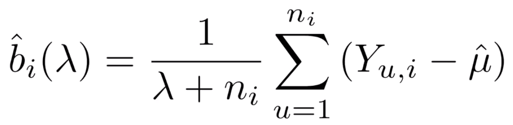
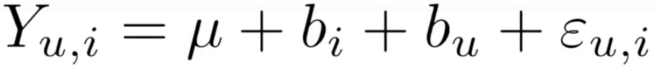
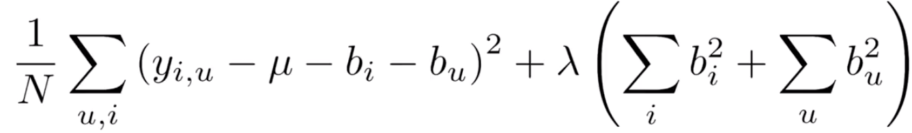

---
references:
- id: wikipediaNetflixPrize
  title: Netflix Prize
  author:
  - family: Wikipedia
  URL: 'https://en.wikipedia.org/wiki/Netflix_Prize'
  type: article
  issued:
    year: 2018
    month: 5
- id: StatSci12
  title: Statistical Significance of the Netflix Challenge
  author:
  - family: Feuerverger
    given: Andrey
  - family: He
    given: Yu
  - family: Khatri
    given: Shashi
  container-title: Statistical Science
  volume: 27
  issue: 2
  page: 202-231
  url: 'https://projecteuclid.org/download/pdfview_1/euclid.ss/1340110870'
  doi: 10.1214/11-STS368
  publisher: Institute of Mathematical Statistics
  type: article-journal
  issued:
    year: 2012
    month: 6
---

```{r setup, include=FALSE}
library(knitr)
source('~/projects/movielens/code/code.R')
knitr::opts_chunk$set(echo = FALSE)
```

## Introduction

This is the first of two Capstone Projects that will be presented in order to complete the Data Science Professional Certificate.

This project is based on the Netflix Prize which was held by the company from 2006 to 2011 or until the Grand Prize was awarded. They were seeking to improve their collaborative filtering algorithm for rating prediction based on previous rating without any other information about users or films but number assigned for the contest. [@wikipediaNetflixPrize].

The prize was given to the team who can improve the RMSE by 1% over the previous year's result. The Progress Prizes for 2007 and 2008 were won respectively by the teams called "BellKor" and "BellKor in BigChaos" and the Grand Prize was winned by a team called "BellKor’s Pragmatic Chaos" on July 26, 2009 with a RMSE of 0.856704 which represented an 10.06% improvement over the contest's baseline. The team "The Ensemble" was able to get the a RMSE of 0.856714, but the prize was given to the first team because the rules specified that the RMSE was limited to 4 decimal places and the prize was given to the first entry that was received [@StatSci12].

The RMSE (Residual Mean Error) can be expressed using the following formula:



As the Netflix datasets are not publicly availables, we will be using the 10M version of the MovieLens dataset. This dataset consist of a table with `r nrow(edx)` rows, each one containing a rate made by a specific user for a specific movie and a validation set with `r nrow(validation)` observations (10% of the data).

The dataset contains rates for `r n_distinct(edx$movieId)` different movies made by `r n_distinct(edx$userId)` different users. The movies with more rates are the following:

```{r Movies}
edx %>% group_by(movieId, title) %>%
	summarize(count = n()) %>%
	arrange(desc(count)) %>%
  head(n = 10) %>%
  knitr::kable()
```

And the less rated movies are the following:

```{r MoviesAsc}
edx %>% group_by(movieId, title) %>%
	summarize(count = n()) %>%
	arrange(count) %>%
  head(n = 10) %>%
  knitr::kable()
```

This plot shows how the data is distributed by rating. The rates were separated in half and whole star points because the latest seems to be more frequent.

```{r freqRates}
edx %>%
  mutate(rateType = ifelse(rating %in% c(1,2,3,4,5), "Whole", "Half")) %>%
  group_by(rating, rateType) %>%
  summarize(count = n()) %>%
  ggplot(aes(x = rating, y = count, color = rateType)) +
  geom_line()+
  ggtitle("Rates")
```

This plot shows how the rates are distributed by movies.

```{r freqMovies}
edx %>% 
  dplyr::count(movieId) %>% 
  ggplot(aes(n)) + 
  geom_histogram(bins = 30, color = "black", fill = "dark blue") + 
  scale_x_log10() + 
  ggtitle("Movies")
```

In this plot we can see that some users are more active than others.

```{r freqUsers}
edx %>% 
  dplyr::count(userId) %>% 
  ggplot(aes(n)) + 
  geom_histogram(bins = 30, color = "black", fill = "dark blue") + 
  scale_x_log10() + 
  ggtitle("Users")
```

The following table shows how the ratings are distributed by genre.

```{r freqGenre}
edx %>% separate_rows(genres, sep = "\\|") %>%
  group_by(genres) %>%
  summarize(count = n()) %>%
  arrange(desc(count)) %>%
  knitr::kable()
```

The goal of this project is to emulate the work done by the "BellKor’s Pragmatic Chaos" team during the Netflix Prize and build a algorithm as close as possible to the one they made.

For this project, the algorithms reviewed during the course PH125.8x Data Science: Machine Learning will be tested and we will choose the best alternative.

## Methodology

For this project all algorithms are based in the course PH125.8x Data Science: Machine Learning from this program.

Some algorithms like knn, Rborist, glm, lda and qda were tried previous to the final procedure, however, the time that the algorithms required to complete the processing was very high and in some cases, the GUI crashed before the process finished.

The first approach to solve the issue was predicting the same rating for all movies, regardless of user and movie. This model can be represented using the following formula



Here epsilon represents independent errors sampled from the same distribution centered at zero, and mu represents the true rating for all movies and users. For the dataset provided, the value of mu is `r round(mu, 2)`.

Using this value as predictor, the algorithm is able to get a RMSE value of `r round(naive_rmse, 2)`, which will be reported as "Just the average".

As seen before, different movies are rated differently, by adding the term b<sub>i</sub> to represent the average rating for movie i, it is expected to get an improvement in the model.



Using this model, we got a RMSE value of `r round(model_1_rmse, 2)`, which will be reported as "Movie Effect Model".

One of the concept used by the winning team to improve the algorithm was regularization. Regularization permits to penalize large estimates that come from small sample sizes. To estimate this, we minimize the following equation:



Using calculus, the following formula shows the values of b that minimize this equation, where n<sub>i</sub> is a number of ratings for movie i. Using this model, when n is large enough, the estimate will be stable.



After regularization, using a value of lambda `r lambdaM`, the new model got a RMSE value of `r round(model_1r_rmse, 2)` which will be reported as "Regularized Movie Effect Model".

But Movie it's not the only bias, it is also clear that there is a substancial variability across users as well, by adding the term bu to represent the average rating for user u. The model now looks like this:



This new model have a RMSE value of `r round(model_2_rmse, 2)` which will be reported as "Movie + Users Effect Model".

Finally, it is required to use regularization at both Movie and User levels, this is the equation that would be minimized:



With this final model, the RMSE value is `r min(rmses)` using a value of lambda `r lambdaMU`, which is a `r round((1.0612018-0.8648170)/1.0612018 * 100 , 2)`% of improvement compared to the average method.

##Results

After testing several methods and algorithms and discarding some specific algorithms like knn, Rborist, glm, lda and qda, among others, the following table shows the specific results for all the final models reviewed during the course:

```{r results}
rmse_results %>% knitr::kable()
```

It's clear that even though, the Movie + User Effects model is very close to the goal, after regularization the algorithm is improved.

##Conclusions

For this specific problem, it's almost impossible to use most of the common machine learning algorithms such as knn, Rborist, glm, lda and qda, among others. Some of them were tried, but in most of the cases R crashed and in other the process taked more than 2 or 3 hours to complete.

The approach and models provided in the course PH125.8x Data Science: Machine Learning proven to be very effective for this kind of tasks.

The experience gained during the previous eight courses proven to be very useful when solving Data Science problems, however, as all courses are introductories, there are a road of kwnoledge ahead.

## References
